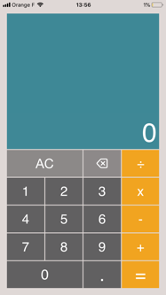
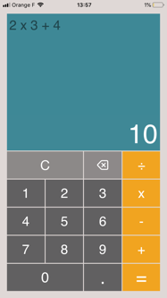

  

# Project 5 : CountOnMe

  

### A Calculator App.

**CountOnMe**

    Students are supposed to clone or fork the repo and improve it. 
    Their focus should be on the following aspects :

**. Responsiveness**

**. Documentation**

**. MVVM Compliance**

**. Tests**

**. Bonus feature**
